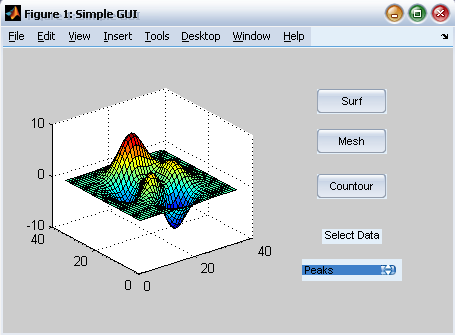

## <center> MATLAB 实验报告 </center>

#### <center> 16171046 谢思涵 </center>

###### 目录

[目录](#目录)
    [上机习题](#一、上机习题)
        [第 1 题](#第 1 题)
        [第 2 题](#第 2 题)
        [第 3 题](#第 3 题)
        [第 4 题](#第 4 题)
        [第 5 题](#第 5 题)
        [第 6 题](#第 6 题)
        [第 7 题](#第 7 题)
        [第 8 题](#第 8 题)
        [第 9 题](#第 9 题)
        [第 10 题](#第 10 题)
        [第 11 题](#第 11 题)
        [第 12 题](#第 12 题)
        [第 13 题](#第 13 题)
        [第 14 题](#第 14 题)
        [第 15 题](#第 15 题)
        [第 16 题](#第 16 题)
        [第 17 题](#第 17 题)
        [第 18 题](#第 18 题)
        [第 19 题](#第 19 题)
        [第 20 题](#第 20 题)
        [第 21 题](#第 21 题)
        [第 22 题](#第 22 题)
    [课题报告](#二、课题报告)
        [生命游戏](#生命游戏：)
        [表面张力](#表面张力：)
        [森林火灾](#森林火灾：)
        [激发介质](#激发介质：)
        [快速生长](#快速生长：)
        [无限波浪](#无限波浪：)
        [渗流集群](#渗流集群：)
        [气体动力](#气体动力：)
        [雪花聚集](#雪花聚集：)
        [沙漏模拟](#沙漏模拟：)
    [心得体会](#三、心得体会)

###### 提醒：

本实验报告中MATLAB代码在MATLAB R2018a 全工具箱下均可正常运行，但不保证一定可以在老版本或工具箱缺失情况下运行。

<div STYLE="page-break-after: always;" />

### 一、上机习题

------

#### 第 1 题

##### 题目：

使用Matlab得到以下矩阵的乘积AB和BA：
$$
A = \begin{bmatrix}
11 &  5 \\
-9 & -4 \\
\end{bmatrix} \qquad
B = \begin{bmatrix}
-7 & -8 \\
 6 &  2 \\
\end{bmatrix}
$$

##### 代码：

```MATLAB
% 班级：16171046，姓名：谢思涵
A = [11  5; -9 -4];
B = [-7 -8;  6  2];
disp("AB = ");
disp(A*B);
disp("BA = ");
disp(B*A);
```

##### 结果：

```MATLAB
>> M1
AB = 
   -47   -78
    39    64

BA = 
    -5    -3
    48    22
```

##### 答案：

解：
$$
AB = \begin{bmatrix}
-47 & -78 \\
 39 &  64 \\
\end{bmatrix} \qquad
BA = \begin{bmatrix}
 -5 &  -3 \\
 48 &  22 \\
\end{bmatrix}
$$

##### 分析：

Matlab以矩阵为核心，输入矩阵后，使用Matlab直接相乘即可，矩阵A\*B与B\*A结果是不同的。

------

#### 第 2 题

##### 题目：

使用Matlab得到以下除法的商和余数：
$$
\frac{14x^3 - 6x^2 + 3x + 9}{5x^2 + 7x - 4}
$$

##### 代码：

```MATLAB
% 班级：16171046，姓名：谢思涵
syms x;
N = 14*x^3 - 6*x^2 + 3*x + 9;
D = 5*x^2 + 7*x - 4;
[R, Q] = polynomialReduce(N, D);
disp("Q = ");
disp(Q);
disp("R = ");
disp(R);
```

##### 结果：

```MATLAB
>> M2
Q = 
(14*x)/5 - 128/25
 
R = 
(1251*x)/25 - 287/25
```

##### 答案：

解：
设Q为商(quotient)，R为余数(remainder)：
$$
Q = \frac{14}{5}x - \frac{128}{25} \\
R = \frac{1251}{25}x - \frac{287}{25} \\
$$

##### 分析：

这题可以使用`coeffs`提取系数，转化为多项式的向量形式，然后使用`deconv`做除法，最后使用`poly2sym`转化为商和余数多项式。但是！查阅官方文档后，发现可以使用`polynomialReduce`一步到位，直接得到结果，需要注意的是`polynomialReduce`和`deconv`输出商和余数的位置是相反的，别弄错了。

------

#### 第 3 题

##### 题目：

使用Matlab计算下式在$x=5$处的值：
$$
\frac{8x^3 - 9x^2 - 7}{10x^3 + 5x^2 + 3x - 7}
$$

##### 代码：

```MATLAB
% 班级：16171046，姓名：谢思涵
f = @(x) (8*x^3 - 9*x^2 - 7)/(10*x^3 + 5*x^2 + 3*x - 7);
x = 5;
disp("f(x = 5) = ");
disp(f(x));
```

##### 结果：

```MATLAB
>> M3
f(x = 5) = 
    0.5553
```

##### 答案：

解：
$$
f(x=5) = 0.5553
$$

##### 分析：

这题可以直接`x=5`，然后`y=f(x)`直接得出结果，但是这样做题不够柔软，可复用性不强，对学习Matlab帮助不大；因此函数应该做成可调用形式，因此接下来考虑使用`syms`或者`Function`解决，但这两者对这样一个小题有点大材小用，显得臃肿，不够优美，因此最后使用匿名函数，将函数写成`f(x)`，再代入`x=5`。

------

#### 第 4 题

##### 题目：

假设$x = [10, -2, 6, 5, -3]$且$y = [9, -3, 2, 5, -1]$，通过手算得到以下运算的结果，并使用Matlab检验计算的结果。
a)	$z = (x < 6)$
b)	$z = (x <= y)$
c)	$z = (x == y)$
d)	$z = (x \sim= y)$

##### 代码：

```MATLAB
% 班级：16171046，姓名：谢思涵
x = [10, -2, 6, 5, -3];
y = [9, -3, 2, 5, -1];
z_a = (x < 6);
z_b = (x <= y);
z_c = (x == y);
z_d = (x ~= y);
disp("a) z = ");
disp(z_a);
disp("b) z = ");
disp(z_b);
disp("c) z = ");
disp(z_c);
disp("d) z = ");
disp(z_d);
```

##### 结果：

```MATLAB
>> M4
a) z = 
   0   1   0   1   1

b) z = 
   0   0   0   1   1

c) z = 
   0   0   0   1   0

d) z = 
   1   1   1   0   1
```

##### 答案：

解：
a)	$z = [0, 1, 0, 1, 1]$
b)	$z = [0, 0, 0, 1, 1]$
c)	$z = [0, 0, 0, 1, 0]$
d)	$z = [1, 1, 1, 0, 1]$

##### 分析：

这题意义不大，只是说明了Matlab中，`True` `False`和C语言一样用0、1代替（和数字有区别，是逻辑值，但也可以运算），另外不等于号为`~=`是和一般语言不同的一点。

------

#### 第 5 题

##### 题目：

假设$x = [-3, 0, 0, 2, 5, 8]$且$y = [-5, -2, 0, 3, 4, 10]$，通过手算得到以下运算的结果，并使用Matlab检验计算的结果。
a)	$z = (y < \sim x)$
b)	$z = (x\ \&\ y)$
c)	$z = (x\ |\ y)$
d)	$z = xor(x, y)$

##### 代码：

```MATLAB
% 班级：16171046，姓名：谢思涵
x = [-3, 0, 0, 2, 5, 8];
y = [-5, -2, 0, 3, 4, 10];
z_a = (y < ~x);
z_b = (x & y);
z_c = (x | y);
z_d = xor(x, y);
disp("a) z = ");
disp(z_a);
disp("b) z = ");
disp(z_b);
disp("c) z = ");
disp(z_c);
disp("d) z = ");
disp(z_d);
```

##### 结果：

```MATLAB
>> M5
a) z = 
   1   1   1   0   0   0

b) z = 
   1   0   0   1   1   1

c) z = 
   1   1   0   1   1   1

d) z = 
   0   1   0   0   0   0
```

##### 答案：

解：
a)	$z = [1, 1, 1, 0, 0, 0]$
b)	$z = [1, 0, 0, 1, 1, 1]$
c)	$z = [1, 1, 0, 1, 1, 1]$
d)	$z = [0, 1, 0, 0, 0, 0]$

##### 分析：

这题展示了Matlab的非，与，或，异或等逻辑操作。

------

#### 第 6 题

##### 题目：

在Matlab中使用一个循环确定：如果用户最初在一个银行帐户中存储\$10000，并且在每年的年终再存储\$10000（银行每年支付6%的利息），那么账户上要积累\$1000000需要多长时间。
##### 代码：

```MATLAB
% 班级：16171046，姓名：谢思涵
M = 10000;
Y = 0;
while M < 1000000
    M = M * 1.06 + 10000;
    Y = Y + 1;
end
disp("Y = ");
disp(Y);
```

##### 结果：

```MATLAB
>> M6
Y = 
    33
```

##### 答案：

解：
需要33年。

##### 分析：

Matlab循环有`for`和`while`两种写法，有范围的、遍历一般用`for`，不知道要循环多久的一般用`while`；Matlab中循环条件不需要括号，但循环结束需要用end定位。

------

#### 第 7 题

##### 题目：

多项式的根出现在工程应用中，例如，电路设计和结构震动。通过绘制多项式的图形，可以找出以下多项式方程在范围$-10 \le x\le 10$内的实根：
$$
4x^5+3x^4-95x^3+5x^2-10x+80=0
$$

##### 代码：

```MATLAB
% 班级：16171046，姓名：谢思涵
syms t;
f = @(x) 4*x.^5 + 3*x.^4 - 95*x.^3 + 5*x.^2 - 10*x + 80;
R = eval(vpasolve(f(t), [-10 10]));
x = -10:0.001:10;
plot(x, f(x), x, 0*x, R, 0*R, "ob");
title("M7-1");
legend("y=4x^5+3x^4-95x^3+5x^2-10x+80", "y=0", "zero-point",'Location','North');
set(gca, "XTick", [-10 R' 10]);
set(gca, "XTickLabel", [-10 R' 10]);
grid on;
```

##### 结果：


##### 答案：

解：
$$
\begin{align*}
x_1 &= -5.3094 \\
x_2 &= 0.9461 \\
x_3 &= 4.4740 \\
\end{align*}
$$

##### 分析：

这道题一般做法应该是多次作图，逐渐逼近解的取值，最后得到结果，但这张图在[-6 5]之间都在0附近徘徊，不太好取值；因此先用`vpasolve`（求范围内高精度数值解）解得3个解的位置，再在图上标出。有几个需要注意的地方，首先`solve`系函数如果输入不是等式，会默认求其零点（`f(x)==0`和`f(x)`效果是一样的），另外只有`solve`是不需要范围的，其求出的也是精确解，需要`vpa`函数将其转化为数字，还需要排除虚数解再判断是否在[-10 10]之间，比较繁琐，直接上vpasolve就好了。画图建议将除了将函数和零点画出来外，最好还把`y=0`一起画了，这样图像比较清晰；画完后可以使用`set(gca, "XTick", [...]);`等函数设置坐标轴，用`legend`函数添加线条信息，这样解和线的位置的大小就一目了然，非常美观。

------

#### 第 8 题

##### 题目：

用速度v、角度A抛掷的一个球，其所达到的高度h(t)和水平距离x(t)如下式所示：
$$
\begin{cases}
\begin{align*}
h(t) &= vt \sin{A} - \frac{1}{2}gt^2 \\
x(t) &= vt \cos{A} \\
\end{align*}
\end{cases}
$$
在地球的表面上，由于重力所造成的加速度是$g = 9.81 m/s^2$。
a)	假设用速度$v = 10 m/s$并以$35^\circ$的角度抛掷这个球，适用Matlab计算这个球将到达多高、将到达多远，以及其碰撞地面时将花费多长时间。
b)	使用部分a中所给出的v和A的值绘制这个球的运行轨迹：即，对于h为正值的情况，绘制h相对于x的图形。
c)	对于$v = 10 m/s$，分别绘制对应于5个角度A值：$20^\circ$、$30^\circ$、$45^\circ$、$60^\circ$和$70^\circ$时的运行轨迹图。
d)	对于$A = 45^\circ$，绘制对应于5个初始速度v值：$10$、$12$、$14$、$16$和$18m/s$时的运行轨迹图。

##### 代码：

```MATLAB
% 班级：16171046，姓名：谢思涵
syms t;
global X H;
g = 9.81;
X = @(v, A) v*t*cosd(A);
H = @(v, A) v*t*sind(A) - 1/2*g*t^2;
% a)
h = H(10, 35);
x = X(10, 35);
t_int = solve(h==0);
t_min = t_int(1);
t_max = t_int(2);
x_max = subs(x, t_max);
h_max = max(subs(h, linspace(t_min, t_max, 100)));
disp("h_max =");
disp(eval(h_max));
disp("x_max =");
disp(eval(x_max));
disp("t_max =");
disp(eval(t_max));

% b)
figure(1);
[x_d, h_d] = parabola(10, 35);
plot(x_d, h_d);
title("M8-1");
legend("v=10m/s A=35°", "Location", "South");
grid on;

% c)
A_list = [20, 30, 45, 60, 70];
figure(2);
hold on;
for A = A_list
    [x_d, h_d] = parabola(10, A);
    plot(x_d, h_d);
end
title("M8-2");
legend("v=10m/s A=20°","v=10m/s A=30°","v=10m/s A=45°","v=10m/s A=60°","v=10m/s A=70°");
grid on;

% d)
v_list = [10, 12, 14, 16, 18];
figure(3);
hold on;
for v = v_list
    [x_d, h_d] = parabola(v, 45);
    plot(x_d, h_d);
end
title("M8-3");
legend("v=10m/s A=45°","v=12m/s A=45°","v=14m/s A=45°","v=16m/s A=45°","v=18m/s A=45°");
grid on;

function [x_d, h_d] = parabola(v, A)
    global X H;
    x = X(v, A);
    h = H(v, A);
    t_int = solve(h==0);
    d = linspace(t_int(1), t_int(2), 100);
    x_d = eval(subs(x, d));
    h_d = eval(subs(h, d));
end
```

##### 结果：

```MATLAB
>> M8
h_max =
    1.6766

x_max =
    9.5789

t_max =
    1.1694
```

##### 答案：

解：
a)	将到达1.6766米高、9.5789米远，耗时1.1694秒。
b)	
c)	
d)	

##### 分析：

这道题由于画图时要重复同样过程的计算，因此写了一个`function parabola`，只要输入v和A，就可以自动计算抛物线点集，这样大大减少计算过程；需要注意`function`如果要调用外面的常量，里外都需要`global`全局化变量；另外使用两层嵌套@匿名函数是可行的，一开始就是这样写的，但调用时不能一次调用，必须先赋给一个中间函数，然后再调用，而且这样很难使用`solve`函数；`grid on`可以开启坐标轴虚线，增加参考性；`hold on`可以使得后画的图不会覆盖，使得多张图可以画在一起，方便比较；而`figure`函数可以定位要输出的图表窗口，这样可以生成多个窗口，不会冲突；当画位置不确定的图时，不建议使用`a:b:c`的形式，比如`1:2:4`，这图就只有1、3两个点，给人感觉戛然而止，点4的存在与否非常影响感官，因此建议使用`linspace(a,c,b)`，可以将[a c]中的点均匀分成b个点，这样画出来的图比较美观。

------

#### 第 9 题

##### 题目：

使用消去变量法，并通过手算来求解以下问题的解：
$$
\begin{cases}
\begin{align*}
6x - 3y + 4z &= 41 \\
12x + 5y - 7z &= -26 \\
-5x + 2y + 6z &= 14 \\
\end{align*}
\end{cases}
$$

##### 代码：

```MATLAB
% 班级：16171046，姓名：谢思涵
syms x y z;
M = [
    ( 6*x - 3*y + 4*z ==  41),
    (12*x + 5*y - 7*z == -26),
    (-5*x + 2*y + 6*z ==  14),
];
[A b] = equationsToMatrix(M);
A = rref([A b]);
disp("x = ");
disp(A(1,4));
disp("y = ");
disp(A(2,4));
disp("z = ");
disp(A(3,4));
```

##### 结果：

```MATLAB
>> M9
x = 
2
 
y = 
-3
 
z = 
5
```

##### 答案：

解：
$$
\begin{cases}
\begin{align*}
x &= 2 \\
y &= -3 \\
z &= 5 \\
\end{align*}
\end{cases}
$$

##### 分析：

这道题方法很多，如果题目没有要求的话，建议使用左除或者直接`solve`函数，但题目要求使用消去变量法（也叫高斯消元法），因此首先使用`equationsToMatrix`提取左右两边系数（Matlab有很多这样神奇的函数），然后使用`rref`化简增广矩阵后，最后一排分别就是x，y，z的解。

------

#### 第 10 题

##### 题目：

a)	使用Matlab求解以下方程的解，x、y和z是参数c的函数：
$$
\begin{cases}
\begin{align*}
x - 5y - 2z &= 11c \\
6x + 3y +\ \ z &= 13c \\
7x + 3y - 5z &= 10c \\
\end{align*}
\end{cases}
$$
b)	在同一张图上绘制解x、y和z相对于c的绘图，其中，$-10 \le c \le 10$。

##### 代码：

```MATLAB
% 班级：16171046，姓名：谢思涵
syms x y z c;
E = [
    (  x - 5*y - 2*z == 11*c);
    (6*x + 3*y +   z == 13*c);
    (7*x + 3*y - 5*z == 10*c);
];
[x y z] = solve(E, [x y z]);
disp("x =");
disp(x);
disp("y =");
disp(y);
disp("z =");
disp(z);
c = -10:0.1:10;
hold on;
grid on;
plot(c, subs(x, c));
plot(c, subs(y, c));
plot(c, subs(z, c));
title("M10-1");
xstr = strcat("x=",string(x));
ystr = strcat("y=",string(y));
zstr = strcat("z=",string(z));
legend(xstr,ystr,zstr,"Location","North");
```

##### 结果：

```MATLAB
>> M10
x =
3*c
 
y =
-2*c
 
z =
c
```

##### 答案：

解：
a)	
$$
\begin{cases}
\begin{align*}
x &= 3c \\
y &= -2c \\
z &= c \\
\end{align*}
\end{cases}
$$
b)	

##### 分析：

求解方程直接上`solve`函数，解出来后，使用c作为自变量画图；使用string可以将任何东西转化为字符串形式，方便标记线条。

------

#### 第 11 题

##### 题目：

使用Matlab求解以下问题的解：
$$
\begin{cases}
\begin{align*}
7x + 9y - 9z &= 22 \\
3x + 2y - 4z &= 12 \\
x + 5y -\ \ z &= -2 \\
\end{align*}
\end{cases}
$$

##### 代码：

```MATLAB
% 班级：16171046，姓名：谢思涵
syms x y z;
E = [
    (7*x + 9*y - 9*z == 22);
    (3*x + 2*y - 4*z == 12);
    (  x + 5*y -   z == -2);
];
[x, y, z, p, c] = solve(E, 'ReturnConditions', true);
disp("x =");
disp(x)
disp("y =");
disp(y);
disp("z =");
disp(z);
```

##### 结果：

```MATLAB
>> M11
x =
(18*z1)/13 + 64/13
 
y =
- z1/13 - 18/13
 
z =
z1
```

##### 答案：

解：
$$
\begin{cases}
\begin{align*}
x &=\ \ \ \frac{18}{13}z + \frac{64}{13} \\
y &=     -\frac{ 1}{13}z - \frac{18}{13} \\
\end{align*}
\end{cases}
$$

##### 分析：

这道题有点特殊，一般而言，解线性方程组的方法是很多的，但除了`solve`其他方法都没有办法得出无数解的情况（无解可以得出），必须自己手动检验矩阵的轶，比较繁琐；但当`solve`方法中`'ReturnConditions'`条件设置为`true`时，可以自动处理这种情况，自动导入一个新的变量来平衡，因此最后将其带回`z`得到结果。

------

#### 第 12 题

##### 题目：

某个物体在$t=2$秒时以速度$v(t) = 5 + 7t^2$从位置$x(2) = 5$处开始移动，确定其在$t=10$秒时的位置。

##### 代码：

```MATLAB
% 班级：16171046，姓名：谢思涵
syms t;
x = int(5+7*t^2, t, 2, 10) + 5;
disp("x(10) =");
disp(vpa(x, 5));
```

##### 结果：

```MATLAB
>> M12
x(10) =
2359.7
```

##### 答案：

解：
在位置2359.7处。

##### 分析：

这题使用`int`积分函数，将2~10秒的速度积分加`x(2)`位置即可得到结果；使用`vpa`函数可以方便地控制显示精度。

------

#### 第 13 题

##### 题目：

以速度$v(0) m/s$垂直上抛一个球。它的测量高度是一个时间的函数：$h(t) = 6t - 4.9t^2$，确定它的初速度。

##### 代码：

```MATLAB
% 班级：16171046，姓名：谢思涵
syms t;
v = diff(6*t - 4.9*t^2);
v_0 = subs(v, 0);
disp("v(0) =");
disp(eval(v_0));
```

##### 结果：

```MATLAB
>> M13
v(0) =
     6
```

##### 答案：

解：
初速度为6米/秒。

##### 分析：

将高度函数使用`diff`求导，再取`t=0`即可得到结果。

------

#### 第 14 题

##### 题目：

建立一个Simulink模型来绘制以下方程的解图形，其中，$0 \le t \le 6$。
$$
\begin{cases}
\begin{align*}
10\ddot y &= 7\sin{(4t)} + 5\cos{(3t)} \\
y(0) &= 4 \\
\dot y(0) &= 1 \\
\end{align*}
\end{cases}
$$

##### 模型：


##### 结果：


##### 分析：

首先使用`func`模块，将输入的t转换为相应函数，然后缩小10倍，再积分两次（要注意输入初始值），最后输出波形。

------

#### 第 15 题

##### 题目：

使用`Transfer Function`模块构建一个Simulink模型来绘制以下方程的解图形，其中，$0 \le t \le 4$。
$$
\begin{cases}
\begin{align*}
2\ddot x + 12\dot x + 10x &= 5u_s(t) - 5u_s(t-2) \\
x(0) = \dot x(0) &= 0 \\
\end{align*}
\end{cases}
$$

##### 模型：


##### 结果：


##### 分析：

首先用延时函数得到等式右边，然后对方程进行反拉普拉斯变换，得到传递函数，将传递函数填入`Transfer Function`，即得到需要的解图形（黄线），这部分对数学要求比较高，只要熟悉了`Simulink`就没有什么难度。

------

#### 第 16 题

##### 题目：

系数矢量$p_1 = [6, 2, 7, -3]$和$p_2 = [10, -8, 5]$代表了变量x的两个多项式。
a)	使用Matlab得到这两个多项式的乘积；并使用最简单的形式表示这个乘积。
b)	如果$x = 2$，那么使用Matlab计算这个乘积的数据值。

##### 代码：

```MATLAB
% 班级：16171046，姓名：谢思涵
p_1 = [6 2 7 -3];
p_2 = [10 -8 5];
p = conv(p_1, p_2);
disp("p(x) = ");
disp(poly2sym(p));
disp("p(x=2) = ");
disp(polyval(p, 2));
```

##### 结果：

```MATLAB
>> M16
p(x) = 
60*x^5 - 28*x^4 + 84*x^3 - 76*x^2 + 59*x - 15
 
p(x=2) = 
        1943
```

##### 答案：

解：
a)	$p(x) = p_1p_2 = 60x^5 - 28x^4 + 84x^3 - 76x^2 + 59x - 15$
b)	$p(x=2) = 1943$

##### 分析：

使用`conv`函数进行两个向量形式多项式的乘法，使用`poly2sym`可以直接把多项式向量形式直接转换为一般形式，然后使用`polyval`可以直接求相应的`p(x)`，都是一步到位。

------

#### 第 17 题

##### 题目：

一个中心在笛卡尔坐标系$(x, y)$点处的椭圆方程是：$\displaystyle\frac{x}{a^2}+\displaystyle\frac{y}{b^2} = 1$，其中，a和b都是用于确定椭圆形状的常数。
a)	适用Matlab得到以下两个方程所描述两个椭圆的交点（其用参数b加以表示）：
$$
\begin{cases}
\begin{align*}
x^2 + \frac{y^2}{b^2} &= 1 \\
\frac{x^2}{100} + 4y^2 &= 1 \\
\end{align*}
\end{cases}
$$
b)	对于$b = 2$的情况，计算部分a)中所得到的解。

##### 代码：

```MATLAB
% 班级：16171046，姓名：谢思涵
syms x y b;
M = [
    (x^2 + y^2/b^2 == 1),
    (x^2/100 + 4*y^2 == 1),
];
[x y] = solve(M, [x y]);
disp("x,y(b) =");
disp([x y]);
disp("x,y(2) =");
disp(eval(subs([x y], b, 2)));
```

##### 结果：

```MATLAB
>> M17
x,y(b) =
[ -10*(((2*b - 1)*(2*b + 1))/((20*b - 1)*(20*b + 1)))^(1/2), -3*11^(1/2)*b*(1/((20*b - 1)*(20*b + 1)))^(1/2)]
[  10*(((2*b - 1)*(2*b + 1))/((20*b - 1)*(20*b + 1)))^(1/2), -3*11^(1/2)*b*(1/((20*b - 1)*(20*b + 1)))^(1/2)]
[ -10*(((2*b - 1)*(2*b + 1))/((20*b - 1)*(20*b + 1)))^(1/2),  3*11^(1/2)*b*(1/((20*b - 1)*(20*b + 1)))^(1/2)]
[  10*(((2*b - 1)*(2*b + 1))/((20*b - 1)*(20*b + 1)))^(1/2),  3*11^(1/2)*b*(1/((20*b - 1)*(20*b + 1)))^(1/2)]
 
x,y(2) =
   -0.9685   -0.4976
    0.9685   -0.4976
   -0.9685    0.4976
    0.9685    0.4976
```

##### 答案：

解：
a)	
$$
\begin{cases}
\begin{align*}
x &= \pm\sqrt{\frac{400b^2-100}{400b^2-1}} \\
y &= \pm\sqrt{\frac{99b^2}{400b^2-1}} \\
\end{align*}
\end{cases}
$$
b)	
$$
b = 2 \Rightarrow
\begin{cases}
\begin{align*}
x &= \pm 0.9685 \\
y &= \pm 0.4976 \\
\end{align*}
\end{cases}
$$

##### 分析：

依然是强大的`solve`函数直接得到结果，然后使用`subs`函数替换其中的`b`为2，得到最后结果。

------

#### 第 18 题

##### 题目：

使用Matlab计算以下的极限值：
a)	$\lim_{x\to 1}{\displaystyle\frac{x^2 - 1}{x^2 - x}}$
b)	$\lim_{x\to -2}{\displaystyle\frac{x^2 - 4}{x^2 + 4}}$
c)	$\lim_{x\to 0}{\displaystyle\frac{x^4 + 2x^2}{x^3 + x}}$

##### 代码：

```MATLAB
% 班级：16171046，姓名：谢思涵
syms x;
a = limit((x^2 - 1)/(x^2 - x), 1);
b = limit((x^2 - 4)/(x^2 + 4), -2);
c = limit((x^4 + 2*x^2)/(x^3 + x), 0);
disp("a =");
disp(a);
disp("b =");
disp(b);
disp("c =");
disp(c);
```

##### 结果：

```MATLAB
>> M18
a =
2
 
b =
0
 
c =
0
```

##### 答案：

解：
a)	$a = 2$
b)	$b = 0$
c)	$c = 0$

##### 分析：

使用`limit`函数，输入题目就可以得到结果，要常翻翻文档，这种方便的函数还是很多的。

------

#### 第 19 题

##### 题目：

找到以下矩阵的特征多项式和特征根：
$$
A = \begin{vmatrix}
-6 & 2 \\
3k & -7 \\
\end{vmatrix}
$$

##### 代码：

```MATLAB
% 班级：16171046，姓名：谢思涵
syms k;
A = [-6, 2; 3*k, -7];
f = poly2sym(charpoly(A));
x = eig(A);
disp("f(x) =");
disp(f);
disp("x =");
disp(x);
```

##### 结果：

```MATLAB
>> M19
f(x) =
x^2 + 13*x - 6*k + 42
 
x =
 - (24*k + 1)^(1/2)/2 - 13/2
   (24*k + 1)^(1/2)/2 - 13/2
```

##### 答案：

解：
$$
\begin{align*}
f(\lambda) &= \lambda^2 + 13\lambda - 6k + 42 \\
\lambda &= \frac{-13\pm\sqrt{24k+1}}{2} \\
\end{align*}
$$

##### 分析：

使用`charpoly`可以得到特征多项式的向量形式，然后转换为多项式一般形式就是特征多项式，对其使用`roots`求解或者`solve`求解都可以得到特征根，我的方法是对行列式直接用`eig`函数直接得到特征根，这个方法应该是最快的。

------

#### 第 20 题

##### 题目：

使用矩阵逆和左除法来求解以下方程组，分别使用c表示出x和y：
$$
\begin{cases}
\begin{align*}
4cx + 5y &= 43 \\
3x - 4y &= -22 \\
\end{align*}
\end{cases}
$$

##### 代码：

```MATLAB
% 班级：16171046，姓名：谢思涵
syms x y c;
M = [
    (4*c*x + 5*y == 43),
    (3*x - 4*y == -22),
];
[A b] = equationsToMatrix(M, [x y]);
S = [inv(A)*b A\b].';
disp("x, y =");
disp(S);
```

##### 结果：

```MATLAB
>> M20
x, y =
[ 62/(16*c + 15), (88*c)/(16*c + 15) + 129/(16*c + 15)]
[ 62/(16*c + 15),             (88*c + 129)/(16*c + 15)]
```

##### 答案：

解：
$$
\begin{cases}
\begin{align*}
x &= \frac{     62}{16c+15} \\
y &= \frac{88c+129}{16c+15} \\
\end{align*}
\end{cases}
$$

##### 分析：

用两种方法都得到了同样的结果，只有表述形式稍微有点不同，两者计算方式不同，前者是先求逆再乘，后者是直接套公式。官方文档建议使用左除法处理这样的情况，粗略比较，左除法比矩阵逆的速度要快两至三倍，并且会基于计算机准确度生成残差，更为准确。

------

#### 第 21 题

##### 题目：

使用GUIDE工具创建如图所示界面。


##### 代码：

```MATLAB
% 班级：16171046，姓名：谢思涵
function varargout = M21(varargin)
gui_Singleton = 1;
gui_State = struct('gui_Name',       mfilename, ...
                   'gui_Singleton',  gui_Singleton, ...
                   'gui_OpeningFcn', @M21_OpeningFcn, ...
                   'gui_OutputFcn',  @M21_OutputFcn, ...
                   'gui_LayoutFcn',  [] , ...
                   'gui_Callback',   []);
if nargin && ischar(varargin{1})
    gui_State.gui_Callback = str2func(varargin{1});
end
if nargout
    [varargout{1:nargout}] = gui_mainfcn(gui_State, varargin{:});
else
    gui_mainfcn(gui_State, varargin{:});
end

function M21_OpeningFcn(hObject, eventdata, handles, varargin)
% 初始化函数

% 产生数据集
handles.peaks=peaks(35);
handles.membrane=membrane;
[x,y] = meshgrid(-8:.5:8);
r = sqrt(x.^2+y.^2) + eps;
sinc = sin(r)./r;
handles.sinc = sinc;
handles.current_data = handles.peaks;
% 绘制默认数据
surf(handles.current_data);
handles.output = hObject;
guidata(hObject, handles);

function varargout = M21_OutputFcn(hObject, eventdata, handles) 
varargout{1} = handles.output;

function surfbutton_Callback(hObject, eventdata, handles)
% surf按钮响应
% 绘制图表
surf(handles.current_data);

function meshbutton_Callback(hObject, eventdata, handles)
% mesh按钮响应
% 绘制图表
mesh(handles.current_data);

function contourbutton_Callback(hObject, eventdata, handles)
% contour按钮响应
% 绘制图表
contour(handles.current_data);

function popup_menu_Callback(hObject, eventdata, handles)
% 下拉框响应

% 获取选取值
str = get(hObject, 'String');
val = get(hObject,'Value');
% 切换数据集
switch str{val};
case 'Peaks' % 使用Peaks
   handles.current_data = handles.peaks;
case 'Membrane' % 使用Membrane
   handles.current_data = handles.membrane;
case 'Sinc' % 使用Sinc
   handles.current_data = handles.sinc;
end
% 绘制图表
surf(handles.current_data);
guidata(hObject,handles);

function popup_menu_CreateFcn(hObject, eventdata, handles)
if ispc && isequal(get(hObject,'BackgroundColor'), get(0,'defaultUicontrolBackgroundColor'))
    set(hObject,'BackgroundColor','white');
end
```

##### 结果：


##### 分析：

使用GUIDE就是大小和对齐不好调整，但很容易就能做出想要的效果，在Matlab官网上也有完整流程，需要注意的是，这里嵌套`function`可以不用写`end`，一样可以识别出来；另外`function`紧接的注释会变成`help`的内容；还有就是`figure`属性中`PaperSize`等属性会影响导出图片的效果，需要多次调整才能得到最好的效果。

------

#### 第 22 题

##### 题目：

使用M语言编程，并利用句柄图形创建如图所示GUI。


##### 代码：

```MATLAB
% 班级：16171046，姓名：谢思涵
function M22
    %构建所有组件
    f = figure( ...
        'Name', 'Simple GUI', ...
        'Visible', 'off', ...
        'Position', [0, 0, 450, 285] ...
    ); %窗口
    hsurf    = uicontrol( ...
        'Style', 'pushbutton', ...
        'String', 'Surf', ...
        'Position', [315, 220, 70, 25], ...
        'Callback', @surfbutton_Callback ...
    ); %surf按钮
    hmesh    = uicontrol( ...
        'Style', 'pushbutton', ...
        'String', 'Mesh', ...
        'Position', [315, 180, 70, 25], ...
        'Callback', @meshbutton_Callback ...
    ); %mesh按钮
    hcontour = uicontrol( ...
        'Style', 'pushbutton', ...
        'String', 'Contour', ...
        'Position', [315, 135, 70, 25], ...
        'Callback', @contourbutton_Callback ...
    ); %contour按钮
    htext  = uicontrol( ...
        'Style', 'text', ...
        'String', 'Select Data', ...
        'Position', [325, 90, 60, 15] ...
    ); %文本提示
    hpopup = uicontrol( ...
        'Style', 'popupmenu', ...
        'String', {'Peaks', 'Membrane', 'Sinc'}, ...
        'Position', [300, 50, 100, 25], ...
        'Callback', @popup_menu_Callback ...
    ); %下拉框
    ha = axes( ...
        'Units', 'pixels', ...
        'Position', [50, 60, 200, 185] ...
    ); %图形区域
    %文字和按钮对齐
    align([hsurf, hmesh, hcontour, htext, hpopup], 'Center', 'None');
    %初始化所有组件
    f.Units = 'normalized';
    ha.Units = 'normalized';
    hsurf.Units = 'normalized';
    hmesh.Units = 'normalized';
    hcontour.Units = 'normalized';
    htext.Units = 'normalized';
    hpopup.Units = 'normalized';
    % 产生数据集
    peaks_data = peaks(35);
    membrane_data = membrane;
    [x, y] = meshgrid(-8:.5:8);
    r = sqrt(x.^2+y.^2) + eps;
    sinc_data = sin(r)./r;
    % 绘制默认数据
    current_data = peaks_data;
    surf(current_data);
    % 将窗口居中
    movegui(f, 'center');
    % 绘制完毕，使窗口可见
    f.Visible = 'on';
    % 所有响应函数
    % 下拉框响应
    function popup_menu_Callback(source, eventdata) 
        % 获取选取值
        str = get(source, 'String');
        val = get(source, 'Value');
        % 切换数据集
        switch str{val};
        case 'Peaks' % 使用Peaks
        	current_data = peaks_data;
        case 'Membrane' % 使用Membrane
            current_data = membrane_data;
        case 'Sinc' % 使用Sinc
            current_data = sinc_data;
        end
        % 绘制图表
        surf(current_data);
    end
    % surf按钮响应
    function surfbutton_Callback(source, eventdata)
        % 绘制图表
        surf(current_data);
    end
    % mesh按钮响应
    function meshbutton_Callback(source, eventdata)
        % 绘制图表
        mesh(current_data);
    end
    % contour按钮响应
    function contourbutton_Callback(source, eventdata) 
        % 绘制图表
        contour(current_data);
    end
end
```

##### 结果：


##### 分析：

完全一致！其实同样代码在老师的PPT或者Matlab官网上都有，而且代码并不复杂，稍微润色一下即可。身为一名程序员说实话，我觉得这样通过写代码的方式写界面，比之前GUIDE拖动的方式优雅多了。

---

<div STYLE="page-break-after: always;" />

### 二、课题报告

#### <center>用MATLAB实现10种元胞自动机</center>

##### <center>16171046 谢思涵</center>

##### 元胞自动机：

元胞自动机（*Cellular Automata*）是一种时间、空间、状态都离散，空间相互作用和时间因果关系为局部的网格动力学模型，具有模拟复杂系统时空演化过程的能力。系统由正方形、三角形或者立方体等基本几何元素的元胞（*Cell*）组成，这些元胞按照一定规则排列可以形成一个空间区域，然后每个元胞之上都有若干种离散或者连续的状态，这些状态在每一个时间步都会按照相同的规则发生变化，于是形成了整个元胞自动机的演化过程。人们通常通过元胞自动机来研究从局部简单的规则到整体复杂动态的涌现过程。

从运行的规则来说，可以分为确定型元胞自动机和随机型元胞自动机。从元胞以及构成的空间来说，可以有一维、二维甚至高维。从元胞的形状来说，可以有四边形、三角形、六边形等等。不过本课题以下涉及的元胞自动机均为二维四边形元胞自动机。

元胞自动机于 20 世纪 50 年代初由计算机之父冯·诺依曼为了模拟生命系统所具有的自复制功能而提出，后来其被视为一种特定的动力学系统，这种系统与符号动力学有着深刻的联系。1970年，著名的二维元胞自动机”生命游戏“被数学家康威提出，引起众多数学家关注，之后元胞自动机才被广泛地应用。

元胞自动机的优美可以用一句话概括：**简单的底层逻辑，导致了纷繁复杂的生命现象。**

---

##### 生命游戏：

最经典而广为人知的元胞自动机，由康威由1970年提出，规则简单但图形多变，有些特定图形可以重复出现甚至移动，有些还可以“生成“特定图形。常被用来演示生命的复杂性与随机性。

###### 规则：

所有元胞有0-1两种状态。

将元胞相邻周围8格（摩尔邻居）相加，设相加之和为S。


下一时刻元胞状态A按如下规则执行，若前条符合，则不用计算之后的规则：

1. 若S = 3，则A置为1
2. 若S = 2，则A保持上一时刻状态不变
3. 其他情况，A置为0

###### 参数：

*最小值~(默认值)~最大值*

- 图形宽度：30~(200)~600

- 边界：无~(无)~有

- 初始分布：0~(0.5)~1

###### 解析：

图形宽度指元胞宽度，可以调整左侧图形大小，但要注意的是图形越大运算越慢；边界指左右是否连通，边界视为0，若没有边界，最左边与最右边是连通的，最上边与最下边是连通的。其他元胞自动机不再重复这两条。

初始分布在0.2-0.7变化不大，然后向两边密度递减。

初始分布为0.2时的图案：


初始分布为0.5时的图案：


初始分布为0.8时的图案：


---

##### 表面张力：

表面张力元胞自动机旨在模拟类似水液体表面张力的图形，元胞自动机运行时间越长，其越趋近于全黑/全白，且运行时间越长，图形越光滑。

###### 规则：

所有元胞有0-1两种状态。

将元胞相邻周围8格（摩尔邻居）及其自身共9格相加，设相加之和为S。

下一时刻元胞状态A按如下规则执行，若前条符合，则不用计算之后的规则：

1. 若S = 4，则A置为1
2. 若S > 5，则A置为1
3. 其他情况，A置为0

###### 参数：

*最小值~(默认值)~最大值*

- 图形宽度：30~(200)~600

- 边界：无~(无)~有

- 初始分布：0.4~(0.5)~0.6

###### 解析：

当初始分布为0.5时

t = 0:


t = 5:


t = 20:


t = 300:


t = 4000:


观察可得，图形随时间变化而光滑。

当初始分布为0.4，t=20时：


当初始分布为0.6，t=20时：


从中可看出，表面张力中初始分布对结果影响较大，0.4和0.6会在短暂时间内就收敛到稳定图形。

---

##### 森林火灾：

森林火灾元胞自动机，顾名思义，旨在模拟森林火灾时的图形，初始图形为全白，随着元胞自动机运行，空白的地方长出树，树稀疏的方位着火影响不大，树密集的方位着火则容易传播。该模型有时也用来研究易燃易爆分子的传播与爆炸，或者其他传播学模型。

###### 规则：

所有元胞有0(空地)-1(树)-2(着火的树)三种状态。

下一时刻元胞状态A按如下规则执行，若前条符合，则不用计算之后的规则：

1. 若A = 2，则A置为0（树被烧变成空地）
2. 若A = 0，则A有高概率变为1（空地长出树）
3. 若A = 1，则A有低概率变为2（树被雷劈着火）
4. 若A = 1，且元胞周围四格有格子为2，则A置为2（火蔓延）
5. 其他情况，A保存不变

###### 参数：

*最小值~(默认值)~最大值*

- 图形宽度：30~(200)~600

- 边界：无~(无)~有

- 生长概率：0.001~(0.01)~0.1

- 着火概率：5e-8~(5e-6)~5e-4

###### 解析：

两个概率的滑块都使用对数标尺。

在默认参数下，每帧空地有0.01概率长出树，树有0.000005概率被点燃，在经过长时间运行后，图形大概稳定在：


如果增加生长概率至0.1：


树木生长速度甚至比树木着火-消失的速度要快，这就造成了火一直灭不掉。

如果将生长概率降低至0.001：


由于生长缓慢，树木将能明显看出稀疏与密集的地区，每次火灾只能在一小块地方发生。

从上面三种情况可以看出生长概率与图案息息相关，如果生长过快，会造成火根本灭不掉，如果生长过慢，火焰则每次只能烧掉一小块地方。这反应了人为地控制树木的稀疏度恰恰是保护森林最好的办法。

着火概率为5e-8时：


可以发现很长时间都难以着火，但一旦着火，整片森林一定全部被点燃。

着火概率为5e-4时：


由于着火概率太高，造成界面上始终有火焰，但由于树木没有机会长成大片，蔓延状的火灾将没有机会出现。

---

##### 激发介质：

激发介质元胞自动机可以从随机图形中出现像“心脏”一样的核心，不断旋转发出“波”，形成特别的图案。值得一提的是，更改参数中的过激发层级，可以形成完全不同的图案，非常神奇。

###### 规则：

所有元胞有0~10共11种状态。(不为0的部分全部着色)

设过激发层级为t，超过t的状态为过激发。

将元胞相邻周围8格（摩尔邻居）大于0但小于t的元胞相加，设相加之和为S。

下一时刻元胞状态A按如下规则执行，若前条符合，则不用计算之后的规则：

1. 若A = 10，则A置为0
2. 若A > 0，则A置为A + 1
3. 若A = 0，S不为0，则A置为1
4. 其他情况，A置为0

###### 参数：

*最小值~(默认值)~最大值*

- 图形宽度：30~(200)~600
- 边界：无~(无)~有
- 初始分布：0.01~(0.04)~0.16
- 过激发层级：5~(6)~7

###### 解析：

过激发层级为6时：


会有像“心脏”一样的核心，不断旋转发出“波”，这也是这个元胞自动机名字的来源。

过激发层级为7时：


仍然有像“心脏”一样的核心，不断旋转发出“波”，但是形状密集了很多，几乎就是完全不同的图案。

过激发层级为5时：


当过激发层级小于等于5时，不再有核心，而是像单向的波浪，碰撞即消失。

---

##### 快速生长：

"种子"元胞自动机是一种来自维基百科，能快速扩张的元胞自动机，它的特点是能规则简单，但能快速铺满整个平面。

###### 规则：

所有元胞有0-1两种状态。

将元胞相邻周围8格（摩尔邻居）相加，设相加之和为S。

下一时刻元胞状态A按如下规则执行，若前条符合，则不用计算之后的规则：

1. 若S = 2，A置为1
2. 其他情况，A置为0

###### 参数：

*最小值~(默认值)~最大值*

- 图形宽度：30~(200)~600

- 边界：无~(无)~有

- 初始分布：0.01~(0.03)~0.09

###### 解析：

t = 95：


t = 125：


t = 200：


t = 310：


可以看到，在310帧时，其已经铺满整个平面，而且不断变化闪动。

---

##### 无限波浪：

“波浪”元胞自动机是一种来自维基百科，能快速扩张的元胞自动机，它的特点是单向扩张传播，存活的元胞会留下蓝色的“影子”，然后再死去，这就造成了“波浪”的效果。

###### 规则：

所有元胞有0（死亡）-1（将死）-2（存活）两种状态。

将元胞相邻周围8格（摩尔邻居）相加，设相加之和为S。

下一时刻元胞状态A按如下规则执行，若前条符合，则不用计算之后的规则：

1. 若A = 2，则A置为1
2. 若A = 1，则A置为0
3. 若A = 0，S = 2，则置A为2
4. 其他情况，A不变为0

###### 参数：

*最小值~(默认值)~最大值*

- 图形宽度：30~(200)~600

- 边界：无~(无)~有

- 初始分布：0.01~(0.03)~0.09

###### 解析：

t = 5：


t = 100：


t = 195：


t = 615：


从以上图案可以初步看出波浪传播的特点了，另外值得一提的是图案形状与元胞宽度是相关的，这是非常有意思的一点。

t = 3100：


经过长时间的运行，我们还能发现重复的图案，在元胞宽度为200的情况下，大约3100帧一次循环，但并非每次都能进入循环（和初始图案有关），其他元胞宽度也不一定能保证进入循环，就非常神秘。以上两点可以期待更进一步的研究。

---

##### 渗流集群：

这个元胞自动机算法和网上流传的“渗流集群”算法有些许的差异：后者一般指在已有图形上进行渗流，来模拟地质渗流环境；我的算法则在其上进行了改进，使其更具观赏性。这个元胞自动机可以用来研究地质渗流环境。

###### 规则：

所有元胞有0-1两种状态，但1有至多6种颜色。

将元胞相邻周围8格（摩尔邻居）相加，设相加之和为S。

下一时刻元胞状态A按如下规则执行，若前条符合，则不用计算之后的规则：

1. 若A = 1，则A不变
2. 若A = 0，S = 1，则A有概率p置为1，且和相邻颜色保存一致。
3. 其他情况，A不变为0

###### 参数：

*最小值~(默认值)~最大值*

- 图形宽度：30~(200)~600
- 边界：无~(无)~有
- 初始分布：1e-5~(5e-5)~6.25e-3
- 颜色数量：1~(3)~6
- 渗流概率：0.005~(0.05)~0.5

###### 解析：

初始分布为5e-5，颜色为3，渗流概率为0.05：

t = 20：


t = 200：


t = 550：


可以发现，渗流从一开始一个点，渐渐扩张到了整个平面，不同颜色的区域分割非常鲜明。

颜色加到6时：


初始分布拉到最高，颜色6时：


从以上两种可以看出，初始分布和颜色数量对图案的影响是较大的。

渗流概率为0.5时：


由于渗流概率变大，更加容易发生颜色“淤积”在一起的情况，但总体来说，对图案影响较小。

---

##### 气体动力：

气体动力元胞，是元胞自动机中一个较大的分支，此规则也被叫作 HPP-气体规则。此元胞的邻居时刻变化，因此某一个方向运动趋势，将继续在同一个方向。该元胞邻居随时间变化，偶数步长时左上方4元胞为邻居关系，奇数步长时右下的4元胞为邻居关系。然后再对每个“4元胞”进行操作，这是对气体等分子最直观的模拟，在物理学上有广泛的应用。这个元胞自动机是在模拟有小孔的，两个不同密度空间下气体分子的运动情况。


###### 规则：

所有元胞有0-1两种状态。

算法采用HPP气体元胞模型。

下一时刻元胞状态A按如下规则执行，若前条符合，则不用计算之后的规则：

1. 若四格中有墙分子，则保持不变

2. 假设粒子是刚刚进入2x2的网格块。它将通过其网格块的中心到达对角的网格中，所以在任何时间步长，每一个元胞与该元胞对角对元胞交换的内容。如下所示，左边显示出来的元胞结构经过一个时间步长变为右边的结构。

   

3. 若对角均为1，另一对角均为0（上图第二排第一个），则四格均取反。

###### 参数：

*最小值~(默认值)~最大值*

- 图形宽度：30~(200)~600

- 边界：无~(无)~有

- 初始分布：0.05~(0.5)~0.95

###### 解析：

初始分布为0.5，t = 10：

t = 10：


初始情况下，左边大约有一半的空间是气体分子，右边则为全空，在正中间有个小孔可以容纳少许气体分子通过。

t = 3000：


根据热力学第二定律，由于左边密集，右边稀疏，左边气体分子更加容易进入右边。经过长时间的运行，两边接近了许多，如果经过足够长的时间，两边的密度会大致趋于一致，但时间越长，这个趋近速度就越慢。

初始分布为0.05时，t = 3000：


初始分布为0.95时，t = 3000：


在相同时间下，不管初始分布是多少，两边的密度在短时间内都是无法完全一样的，但熵增是一致的。而且不管初始分布是多少，在经过“足够长的时间”，左右两边的密度是一样的。

---

##### 雪花聚集：

雪花元胞自动机是运用气体元胞模型的，用来模拟水气体凝结的模型。蒸汽随机运动，如果撞到冰分子，就会凝结（生活中一般由灰尘开启第一步凝结）。最后凝结成漂亮的雪花（或冰雹）。

###### 规则：

所有元胞有0-1（蒸汽）-2（冰）两种状态。

算法采用HPP气体元胞模型。

下一时刻元胞状态A按如下规则执行，若前条符合，则不用计算之后的规则：

1. 若四元胞中有2，则将所有1置为2（凝结）
2. 顺时针或者逆时针旋转四元胞（随机飘动）

###### 参数：

*最小值~(默认值)~最大值*

- 图形宽度：30~(200)~600

- 边界：无~(无)~有

- 初始分布：0.06~(0.1)~0.3

###### 解析：

初始分布为0.1，t = 10：


一开始气体分子分布为0.1，正中间有初始的4格凝结点。

t = 200：


t = 1500：


t = 3000：


时间越长，凝结速度就越慢，这是因为雪花集中在中心，而边角的分子不容易移动到中间。

t = 6810：


经过近7000帧，终于所有的水分子都凝结成了雪花。

初始分布为0.3时：


如果增加初始分布到0.2以上，那么凝结的速度就会非常非常快，一眨眼就能覆盖整个屏幕（凝结出来的大概是冰雹吧）。

初始分布为0.06时：


可以看到凝结速度就非常非常慢，要经过漫长的时间才能完全凝结。

---

##### 沙漏模拟：

沙漏元胞自动机是运用气体元胞模型的，用来模拟砂砾下落的模型。砂砾不断的下落堆积，用沙漏来表现是最好的。

###### 规则：

所有元胞有0-1两种状态。

算法采用HPP气体元胞模型。

下一时刻元胞状态A按如下规则执行：

1. 若有墙壁，视情况执行以下步骤

2. 若上侧有砂砾，而下侧为空，则有一定概率不懂（粘滞概率）

3. 若上边有砂砾，而下边为空，则下落（除第3排的情况）

4. 若一侧（左或右）有砂砾，另一侧为空，则倾倒（第3排情况）

5. 若一边有砂砾，另一边为空，则有小概率互换（震荡概率）

   

###### 参数：

*最小值~(默认值)~最大值*

- 图形宽度：30~(200)~600
- 边界：无~(无)~有
- 震荡概率：0.01~(0.05)~0.09
- 粘滞概率：0.05~(0.5)~0.95

###### 解析：

沙漏的形状绘画采用的是图像处理工具箱里的蒙版操作`roipoly`，可以对数组进行形状剪切操作。

当震荡概率为0.05，粘滞概率为0.5时：

t = 10：


t = 2000：


t = 5000：


t = 7000：


大约7000帧时，砂砾下落完毕，沙漏的下落还是非常真实的，经过几次运行，运行时长大约都在7000左右，比较稳定。

震荡概率为0.09时：


震荡概率基本不影响沙漏完成时间，但一定的震荡概率可以使沙子的下落更加真实和贴近生活，增加随机性；还可以避免砂砾像小山一样堆起来，震荡概率可以使“小山”随时间倾倒、变平，更加真实。

粘滞概率为0.05时：


粘滞概率为0.95时：


粘滞概率是个我设定的参数，对应生活中空气湿度造成的影响，低的粘滞概率说明是干沙子，沙子更容易下落，沙子像水龙头一样下落，4000帧就完全落完；而高的粘滞概率说明沙子更有粘性，更容易被堵住，我运行了37000帧才完全落空，而且稳定性也较差（有时要38000帧）。

从上面两个可以看出震荡概率对沙漏时长影响不大，而粘滞概率对沙漏影响较大。

---

##### 界面设计：


左边是图案区域，坐标轴会随着元胞宽度的变化而变化。

运行时长指从运行开始经过了多少帧。

选择自动机规则是一个下拉框，内含10个选项，选择后自动更新元胞宽度和界面。

重新开始按钮会更新元胞宽度并重置左侧图形。

运行/停止按钮可以让左侧元胞自动机运行停止（只是运行停止，参数更改仍然有效）。

下一步按钮可以逐帧运行（感觉上会有bug，但至今没遇到过）。

元胞宽度拖动条可以使元胞宽度在30~600之间的整数选择，如果宽度取整打钩则只能取到50的倍数。调整好后点击重新开始即可更改左侧图形宽度。

重置参数按钮可以重置所有特定参数。

添加/去除边界按钮可以添加边界，如果没有边界，则左边与右边是连通的，上边与下边是连通的。

其他拖动条随元胞自动机不同而不同，这些组件的Tag属性写明了哪些组件，通过`cell_show`函数自动显示相应组件。

---

##### 代码设计：

`cell_list`是关联列表，可以使程序自动调整初始化和运行函数以及参数。

`cell_data`包含了所有可动参数以及颜色方案，可以在这里更改图案的颜色。

总的来说，代码里用了许许多多的Trick和技巧，重构次数也不少于3次，包含了我大量的心血，实在不是三言两语能讲清楚的，其中有一些看起来很奇怪的代码写法，这样写的原因完全是因为这样更快，我通过tic、toc实验了许许多多细节上的运行速度，尽力提升哪怕每帧0.001秒的速度。

---

##### 不足之处：

颜色没法显式更改，我本希望颜色可以在界面中自由选择的，但没做出来。

元胞宽度为600时，运行速度显著变慢，这应该是解释型语言的瓶颈，可以考虑将常用函数预先用C语言编译，但这个工作量比较大，而且不符合MATLAB课程的要求。

主循环不应该写在外面，应该写成函数，加载完组件后调用。

---

##### 具体代码：

```MATLAB
% 班级：16171046，姓名：谢思涵
function M0
    cell_list = [
        {'生命游戏' @cell_life_init  @cell_life_run  'life' }
        {'表面张力' @cell_surf_init  @cell_surf_run  'surf' }
        {'森林火灾' @cell_tree_init  @cell_tree_run  'tree' }
        {'激发介质' @cell_heart_init @cell_heart_run 'heart'}
        {'快速生长' @cell_seed_init  @cell_seed_run  'seed' }
        {'无限波浪' @cell_brain_init @cell_brain_run 'brain'}
        {'渗流集群' @cell_flow_init  @cell_flow_run  'flow' }
        {'气体动力' @cell_gas_init   @cell_gas_run   'gas'  }
        {'雪花聚集' @cell_snow_init  @cell_snow_run  'snow' }
        {'沙漏模拟' @cell_sand_init  @cell_sand_run  'sand' }
    ];
    cell_data = struct( ...
        'common', struct( ...
            'w', 200, ...
            'wall', 0, ...
            'wall_w', 2, ...
            'step', 2:2:199 ...
        ), ...
        'life', struct( ...
            'color', struct( ... %颜色方案
                'dead', 8, ...
                'live', 7, ...
                'wall', 3 ...
            ), ...
            'pinit', 5e-1 ... %初始分布概率
        ), ...
        'surf', struct( ...
            'color', struct( ... %颜色方案
                'dead', 7, ...
                'live', 4, ...
                'wall', 8 ...
            ), ...
            'pinit', 5e-1 ... %初始分布概率
        ), ...
        'tree', struct( ...
            'color', struct( ... %颜色方案
                'empty', 7, ...
                'fire', 1, ...
                'tree', 2, ...
                'wall', 8 ...
            ), ...
            'pfire', 5e-6, ... %树着火概率
            'pgrow', 1e-2 ... %空地长树概率
        ), ...
        'heart', struct( ...
            'color', struct( ... %颜色方案
                'dead', 8, ...
                'live', 6, ...
                'wall', 7 ...
            ), ...
            'pinit', 4e-2, ... %初始分布概率
            'tlevel', 6, ... %过激发层级 5 6 7是完全不同的图案
            'tmax', 10 ... %最大激发层级
        ), ...
        'seed', struct( ...
            'color', struct( ... %颜色方案
                'dead', 8, ...
                'live', 5, ...
                'wall', 7 ...
            ), ...
            'pinit', 3e-3 ... %初始分布概率
        ), ...
        'brain', struct( ...
            'color', struct( ... %颜色方案
                'dead', 8, ...
                'dying', 6, ...
                'live', 7, ...
                'wall', 2 ...
            ), ...
            'pinit', 3e-3 ... %初始分布概率
        ), ...
        'flow', struct( ...
            'color', struct( ... %颜色方案
                'dead', 8, ...
                'live', [6 5 3 4 2 1], ...
                'wall', 7 ...
            ), ...
            'pinit', 5e-5, ... %初始分布概率
            'ccolor', 3, ... %初始颜色数量
            'pflow', 5e-2 ... %渗流概率
        ), ...
        'gas', struct( ...
            'color', struct( ... %颜色方案
                'empty', 8, ...
                'gas', 3, ...
                'wall', 6 ...
            ), ...
            'pinit', 4e-1 ... %初始分布概率
        ), ...
        'snow', struct( ...
            'color', struct( ... %颜色方案
                'empty', 8, ...
                'steam', 4, ...
                'snow', 6 ...
            ), ...
            'pinit', 1e-1 ... %初始分布概率
        ), ...
        'sand', struct( ...
            'color', struct( ... %颜色方案
                'empty', 4, ...
                'sand', 3, ...
                'wall', 8 ...
            ), ...
            'pshake', 5e-2, ... %晃动震荡概率
            'pstick', 5e-1 ... %粘滞下落概率
        ) ...
    );
    %构建所有组件
    hfig = figure( ...
        'Units', 'pixels', ...
        'Name', '元胞自动机', ...
        'Visible', 'off', ...
        'Position', [0, 0, 1000, 700], ...
        'Resize', 'off', ...
        'NumberTitle', 'off' ...
    ); %窗口
    axes( ...
        'Units', 'pixels', ...
        'Position', [50, 50, 600, 600] ...
    ); %图形区域
    htime = uicontrol( ...
        'Units', 'pixels', ...
        'Style', 'text', ...
        'FontSize', 12, ...
        'String', '运行时长：    0', ...
        'Value', 0, ...
        'Position', [650, 630, 350, 25] ...
    ); %运行时长文本
    uicontrol( ...
        'Units', 'pixels', ...
        'Style', 'text', ...
        'FontSize', 12, ...
        'String', '选择自动机规则', ...
        'Position', [650, 600, 350, 25] ...
    ); %文本提示
    hpopup = uicontrol( ...
        'Units', 'pixels', ...
        'Style', 'popupmenu', ...
        'FontSize', 12, ...
        'String', '下拉菜单', ...
        'Value', 1, ...
        'Position', [700, 575, 100, 25], ...
        'Callback', @popup_Callback ...
    ); %下拉框
    uicontrol( ...
        'Units', 'pixels', ...
        'Style', 'pushbutton', ...
        'FontSize', 12, ...
        'String', '重新开始', ...
        'Position', [700, 530, 100, 25], ...
        'Callback', @restart_Callback ...
    ); %restart重启按钮
    hpause = uicontrol( ...
        'Units', 'pixels', ...
        'Style', 'togglebutton', ...
        'FontSize', 12, ...
        'String', '暂停', ...
        'Position', [700, 490, 100, 25], ...
        'Callback', @pause_Callback ...
    ); %pause暂停按钮
    uicontrol( ...
        'Units', 'pixels', ...
        'Style', 'pushbutton', ...
        'FontSize', 12, ...
        'String', '下一步', ...
        'Position', [700, 450, 100, 25], ...
        'Callback', @next_Callback ...
    ); %next下一步按钮
    htext = uicontrol( ...
        'Units', 'pixels', ...
        'Style', 'text', ...
        'FontSize', 12, ...
        'Value', 0, ...
        'String', '元胞宽度：0', ...
        'Position', [700, 410, 200, 25] ...
    ); %width文字
    hfix = uicontrol( ...
        'Units', 'pixels', ...
        'Style', 'checkbox', ...
        'String', '宽度取整', ...
        'FontSize', 12, ...
        'Value', 1, ...
        'Position', [700, 360, 100, 25], ...
        'Callback', {@width_Callback, htext} ...
    ); %width-fix取整框
    uicontrol( ...
        'Units', 'pixels', ...
        'Style', 'slider', ...
        'Max', 600, ...
        'Min', 30, ...
        'Value', 200, ...
        'SliderStep', [0.00175 0.0877], ...
        'FontSize', 12, ...
        'Position', [700, 385, 200, 25], ...
        'CreateFcn', {@width_Callback, htext, hfix}, ...
        'Callback', {@width_Callback, htext, hfix} ...
    ); %width拖动条
    uicontrol( ...
        'Units', 'pixels', ...
        'Style', 'togglebutton', ...
        'FontSize', 12, ...
        'String', '重置参数', ...
        'Position', [700, 300, 100, 25], ...
        'Callback', @reset_Callback ...
    ); %reset按钮
    uicontrol( ...
        'Units', 'pixels', ...
        'Style', 'togglebutton', ...
        'FontSize', 12, ...
        'String', '添加边界', ...
        'Position', [700, 260, 100, 25], ...
        'Tag', 'life tree surf heart seed brain flow', ...
        'Callback', @wall_Callback ...
    ); %wall按钮
    %life部分
    htext = uicontrol( ...
        'Units', 'pixels', ...
        'Style', 'text', ...
        'FontSize', 12, ...
        'String', '初始分布：0', ...
        'Tag', 'life', ...
        'Position', [700, 220, 200, 25] ...
    ); %初始分布文字
    uicontrol( ...
        'Units', 'pixels', ...
        'Style', 'slider', ...
        'FontSize', 12, ...
        'Value', 0.5, ...
        'Position', [700, 195, 200, 25], ...
        'Tag', 'life', ...
        'Callback', {@life_pinit_Callback, htext} ...
    ); %初始分布
    %surf部分
    htext = uicontrol( ...
        'Units', 'pixels', ...
        'Style', 'text', ...
        'FontSize', 12, ...
        'String', '初始分布：0', ...
        'Tag', 'surf', ...
        'Position', [700, 220, 200, 25] ...
    ); %初始分布文字
    uicontrol( ...
        'Units', 'pixels', ...
        'Style', 'slider', ...
        'FontSize', 12, ...
        'Value', 0.5, ...
        'Position', [700, 195, 200, 25], ...
        'Tag', 'surf', ...
        'Callback', {@surf_pinit_Callback, htext} ...
    ); %初始分布
    %tree部分
    htext = uicontrol( ...
        'Units', 'pixels', ...
        'Style', 'text', ...
        'FontSize', 12, ...
        'String', '生长概率：0', ...
        'Tag', 'tree', ...
        'Position', [700, 220, 200, 25] ...
    ); %生长概率文字
    uicontrol( ...
        'Units', 'pixels', ...
        'Style', 'slider', ...
        'FontSize', 12, ...
        'Value', 0.5, ...
        'Position', [700, 195, 200, 25], ...
        'Tag', 'tree', ...
        'Callback', {@tree_pgrow_Callback, htext} ...
    ); %生长概率
    htext = uicontrol( ...
        'Units', 'pixels', ...
        'Style', 'text', ...
        'FontSize', 12, ...
        'String', '着火概率：0', ...
        'Tag', 'tree', ...
        'Position', [700, 155, 200, 25] ...
    ); %着火概率文字
    uicontrol( ...
        'Units', 'pixels', ...
        'Style', 'slider', ...
        'FontSize', 12, ...
        'Value', 0.5, ...
        'Position', [700, 130, 200, 25], ...
        'Tag', 'tree', ...
        'Callback', {@tree_pfire_Callback, htext} ...
    ); %着火概率
    %heart部分
    htext = uicontrol( ...
        'Units', 'pixels', ...
        'Style', 'text', ...
        'FontSize', 12, ...
        'String', '初始分布：0', ...
        'Tag', 'heart', ...
        'Position', [700, 220, 200, 25] ...
    ); %初始分布文字
    uicontrol( ...
        'Units', 'pixels', ...
        'Style', 'slider', ...
        'FontSize', 12, ...
        'Value', 0.5, ...
        'Position', [700, 195, 200, 25], ...
        'Tag', 'heart', ...
        'Callback', {@heart_pinit_Callback, htext} ...
    ); %初始分布
    htext = uicontrol( ...
        'Units', 'pixels', ...
        'Style', 'text', ...
        'FontSize', 12, ...
        'String', '过激发层级：0', ...
        'Tag', 'heart', ...
        'Position', [700, 155, 200, 25] ...
    ); %过激发层级文字
    uicontrol( ...
        'Units', 'pixels', ...
        'Style', 'slider', ...
        'FontSize', 12, ...
        'Value', 0.5, ...
        'SliderStep', [0.4 0.4], ...
        'Position', [700, 130, 200, 25], ...
        'Tag', 'heart', ...
        'Callback', {@heart_tlevel_Callback, htext} ...
    ); %过激发层级
    %seed部分
    htext = uicontrol( ...
        'Units', 'pixels', ...
        'Style', 'text', ...
        'FontSize', 12, ...
        'String', '初始分布：0', ...
        'Tag', 'seed', ...
        'Position', [700, 220, 200, 25] ...
    ); %初始分布文字
    uicontrol( ...
        'Units', 'pixels', ...
        'Style', 'slider', ...
        'FontSize', 12, ...
        'Value', 0.5, ...
        'Position', [700, 195, 200, 25], ...
        'Tag', 'seed', ...
        'Callback', {@seed_pinit_Callback, htext} ...
    ); %初始分布
    %brain部分
    htext = uicontrol( ...
        'Units', 'pixels', ...
        'Style', 'text', ...
        'FontSize', 12, ...
        'String', '初始分布：0', ...
        'Tag', 'brain', ...
        'Position', [700, 220, 200, 25] ...
    ); %初始分布文字
    uicontrol( ...
        'Units', 'pixels', ...
        'Style', 'slider', ...
        'FontSize', 12, ...
        'Value', 0.5, ...
        'Position', [700, 195, 200, 25], ...
        'Tag', 'brain', ...
        'Callback', {@brain_pinit_Callback, htext} ...
    ); %初始分布
    %flow部分
    htext = uicontrol( ...
        'Units', 'pixels', ...
        'Style', 'text', ...
        'FontSize', 12, ...
        'String', '初始分布：0', ...
        'Tag', 'flow', ...
        'Position', [700, 220, 200, 25] ...
    ); %初始分布文字
    uicontrol( ...
        'Units', 'pixels', ...
        'Style', 'slider', ...
        'FontSize', 12, ...
        'Value', 0.5, ...
        'Position', [700, 195, 200, 25], ...
        'Tag', 'flow', ...
        'Callback', {@flow_pinit_Callback, htext} ...
    ); %初始分布
    htext = uicontrol( ...
        'Units', 'pixels', ...
        'Style', 'text', ...
        'FontSize', 12, ...
        'String', '初始颜色：0', ...
        'Tag', 'flow', ...
        'Position', [700, 155, 200, 25] ...
    ); %初始颜色文字
    uicontrol( ...
        'Units', 'pixels', ...
        'Style', 'slider', ...
        'FontSize', 12, ...
        'Value', 0.5, ...
        'SliderStep', [0.2 0.4], ...
        'Position', [700, 130, 200, 25], ...
        'Tag', 'flow', ...
        'Callback', {@flow_ccolor_Callback, htext} ...
    ); %初始颜色
    htext = uicontrol( ...
        'Units', 'pixels', ...
        'Style', 'text', ...
        'FontSize', 12, ...
        'String', '渗流概率：0', ...
        'Tag', 'flow', ...
        'Position', [700, 90, 200, 25] ...
    ); %渗流概率文字
    uicontrol( ...
        'Units', 'pixels', ...
        'Style', 'slider', ...
        'FontSize', 12, ...
        'Value', 0.5, ...
        'Position', [700, 65, 200, 25], ...
        'Tag', 'flow', ...
        'Callback', {@flow_pflow_Callback, htext} ...
    ); %渗流概率
    %gas部分
    htext = uicontrol( ...
        'Units', 'pixels', ...
        'Style', 'text', ...
        'FontSize', 12, ...
        'String', '初始分布：0', ...
        'Tag', 'gas', ...
        'Position', [700, 220, 200, 25] ...
    ); %初始分布文字
    uicontrol( ...
        'Units', 'pixels', ...
        'Style', 'slider', ...
        'FontSize', 12, ...
        'Value', 0.5, ...
        'Position', [700, 195, 200, 25], ...
        'Tag', 'gas', ...
        'Callback', {@gas_pinit_Callback, htext} ...
    ); %初始分布
    %snow部分
    htext = uicontrol( ...
        'Units', 'pixels', ...
        'Style', 'text', ...
        'FontSize', 12, ...
        'String', '初始分布：0', ...
        'Tag', 'snow', ...
        'Position', [700, 220, 200, 25] ...
    ); %初始分布文字
    uicontrol( ...
        'Units', 'pixels', ...
        'Style', 'slider', ...
        'FontSize', 12, ...
        'Value', 0.5, ...
        'Position', [700, 195, 200, 25], ...
        'Tag', 'snow', ...
        'Callback', {@snow_pinit_Callback, htext} ...
    ); %初始分布
    %sand部分
    htext = uicontrol( ...
        'Units', 'pixels', ...
        'Style', 'text', ...
        'FontSize', 12, ...
        'String', '震荡概率：0', ...
        'Tag', 'sand', ...
        'Position', [700, 220, 200, 25] ...
    ); %震荡概率文字
    uicontrol( ...
        'Units', 'pixels', ...
        'Style', 'slider', ...
        'FontSize', 12, ...
        'Value', 0.5, ...
        'Position', [700, 195, 200, 25], ...
        'Tag', 'sand', ...
        'Callback', {@sand_pshake_Callback, htext} ...
    ); %震荡概率
    htext = uicontrol( ...
        'Units', 'pixels', ...
        'Style', 'text', ...
        'FontSize', 12, ...
        'String', '粘滞概率：0', ...
        'Tag', 'sand', ...
        'Position', [700, 155, 200, 25] ...
    ); %粘滞概率文字
    uicontrol( ...
        'Units', 'pixels', ...
        'Style', 'slider', ...
        'FontSize', 12, ...
        'Value', 0.5, ...
        'Position', [700, 130, 200, 25], ...
        'Tag', 'sand', ...
        'Callback', {@sand_pstick_Callback, htext} ...
    ); %粘滞概率
    %所有文字和按钮对齐
    align(findobj(hfig, 'Type', 'UIControl'), 'Center', 'None');
    % 产生数据集
    cell_reset_all();
    hpopup.String = cell_list(:,1);
    v = hpopup.Value;
    cell_init = cell_list{v,2};
    cell_run = cell_list{v,3};
    cell_p = cell_data.(cell_list{v,4});
    cell_c = cell_p.color;
    cell_d = cell_data.common;
    width = cell_d.w;
    cells = zeros(width);
    himg = image(cat(3, cells, cells, cells));
    cell_e = {}; %额外数据
    cells_w = cell_out(); %边界数据
    % 绘制默认数据
    cell_show(cell_list{v,4});
    cell_time(0);
    cell_draw();
    % 将窗口居中
    movegui(hfig, 'center');
    % 绘制完毕，使窗口可见
    hfig.Visible = 'on';
    while isvalid(hfig)
        if hpause.Value == 0
            cell_time(1);
        end
        cell_draw();
        pause(0.01);
    end % 主循环
    % 所有响应函数
    function popup_Callback(src, event)
        % 下拉框响应 切换数据集
        val = src.Value;
        cell_init = cell_list{val,2};
        cell_run = cell_list{val,3};
        cell_p = cell_data.(cell_list{val,4});
        cell_c = cell_p.color;
        % 初始化图形
        cell_show(cell_list{val,4});
        cell_time(0);
    end
    function restart_Callback(src, event)
        % restart按钮响应
        % 初始化图形
        cell_time(0);
    end
    function pause_Callback(src, event)
        % pause按钮响应
        if src.Value == 0
            src.String = '暂停';
        else
            src.String = '运行';
        end
    end
    function next_Callback(src, event)
        % next按钮响应
        cell_time(1);
    end
    function width_Callback(src, event, htext, varargin)
        % width按钮响应(2个按钮)
        % 这里的逻辑很复杂，slider会调用checkbox
        switch length(varargin)
            case 1
                src.Value = round(src.Value);
                htext.Value = src.Value;
                width_Callback(varargin{1}, event, htext)
            case 0
                val = htext.Value;
                if src.Value == 1
                    val = round(val / 50) * 50;
                end
                htext.String = sprintf('元胞宽度：%3d', val);
                cell_data.common.w = val;
                cell_d = cell_data.common;
        end
    end
    function reset_Callback(src, event)
        % reset按钮响应 重置可变参数
        for uiobj = findobj(hfig, '-regexp', 'Tag', '[^'']')'
            if strcmp(uiobj.Style, 'slider') && strcmp(uiobj.Visible, 'on')
                uiobj.Value = 0.5;
                uiobj.Callback{1}(uiobj,'reset',uiobj.Callback{2:end})
            end
        end
    end
    function wall_Callback(src, event)
        % wall按钮响应
        if src.Value == 0
            src.String = '添加边界';
        else
            src.String = '去除边界';
        end
        cell_data.common.wall = src.Value;
        cell_d = cell_data.common;
    end
    function life_pinit_Callback(src, event, htext)
        val = round(src.Value * 100);
        htext.String = sprintf('初始分布：%3d%%', val);
        cell_data.life.pinit = val / 100;
        cell_p = cell_data.life;
    end
    function surf_pinit_Callback(src, event, htext)
        val = round(src.Value * 200) / 10 + 40;
        htext.String = sprintf('初始分布：%3.1f%%', val);
        cell_data.surf.pinit = val / 100;
        cell_p = cell_data.surf;
    end
    function tree_pgrow_Callback(src, event, htext)
        val = 100 ^ src.Value / 10;
        htext.String = sprintf('生长概率：%3.2f%%', val);
        cell_data.tree.pgrow = val / 100;
        cell_p = cell_data.tree;
    end
    function tree_pfire_Callback(src, event, htext)
        val = 10000 ^ src.Value / 200000;
        htext.String = sprintf('着火概率：%3.1E%%', val);
        cell_data.tree.pfire = val / 100;
        cell_p = cell_data.tree;
    end
    function heart_pinit_Callback(src, event, htext)
        val = 16 ^ src.Value;
        htext.String = sprintf('初始分布：%3.1f%%', val);
        cell_data.heart.pinit = val / 100;
        cell_p = cell_data.heart;
    end
    function heart_tlevel_Callback(src, event, htext)
        src.Value = round(src.Value * 2) / 2;
        val = src.Value * 2 + 5;
        htext.String = sprintf('过激发层级：%3d', val);
        cell_data.heart.tlevel = val;
        cell_p = cell_data.heart;
    end
    function seed_pinit_Callback(src, event, htext)
        val = 9 ^ src.Value / 10;
        htext.String = sprintf('初始分布：%3.2f%%', val);
        cell_data.seed.pinit = val / 100;
        cell_p = cell_data.seed;
    end
    function brain_pinit_Callback(src, event, htext)
        val = 9 ^ src.Value / 10;
        htext.String = sprintf('初始分布：%3.2f%%', val);
        cell_data.brain.pinit = val / 100;
        cell_p = cell_data.brain;
    end
    function flow_pinit_Callback(src, event, htext)
        val = 625 ^ (src.Value ^ 2) / 1000;
        htext.String = sprintf('初始分布：%3.4f%%', val);
        cell_data.flow.pinit = val / 100;
        cell_p = cell_data.flow;
    end
    function flow_ccolor_Callback(src, event, htext)
        src.Value = floor(src.Value * 5) / 5;
        val = src.Value * 5 + 1;
        htext.String = sprintf('颜色数量：%3d', val);
        cell_data.flow.ccolor = val;
        cell_p = cell_data.flow;
    end
    function flow_pflow_Callback(src, event, htext)
        val = 100 ^ src.Value / 2;
        htext.String = sprintf('渗流概率：%3.2f%%', val);
        cell_data.flow.pflow = val / 100;
        cell_p = cell_data.flow;
    end
    function gas_pinit_Callback(src, event, htext)
        val = src.Value * 90 + 5;
        htext.String = sprintf('初始分布：%3.1f%%', val);
        cell_data.gas.pinit = val / 100;
        cell_p = cell_data.gas;
    end
    function snow_pinit_Callback(src, event, htext)
        val = 25 ^ src.Value + 5;
        htext.String = sprintf('初始分布：%3.1f%%', val);
        cell_data.snow.pinit = val / 100;
        cell_p = cell_data.snow;
    end
    function sand_pshake_Callback(src, event, htext)
        val = src.Value * 8 + 1;
        htext.String = sprintf('震荡概率：%3.2f%%', val);
        cell_data.sand.pshake = val / 100;
        cell_p = cell_data.sand;
    end
    function sand_pstick_Callback(src, event, htext)
        val = src.Value * 90 + 5;
        htext.String = sprintf('粘滞概率：%3.0f%%', val);
        cell_data.sand.pstick = val / 100;
        cell_p = cell_data.sand;
    end
    % 处理函数
    function cell_reset_all()
        % 重置所有可变参数
        for uiobj = findobj(hfig, '-regexp', 'Tag', '[^'']')'
            if strcmp(uiobj.Style, 'slider')
                uiobj.Value = 0.5;
                uiobj.Callback{1}(uiobj,'reset',uiobj.Callback{2:end})
            end
        end
    end
    function cell_time(state)
        % 运行和初始化函数，统计运行时间
        % state = 0时为初始化，state = 1是为下一步
        if state
            htime.Value = htime.Value + 1;
            cell_run();
        else
            htime.Value = 0;
            cell_size();
            cell_init();
        end
        htime.String = sprintf('运行时长：%5d', htime.Value);
    end
    function cell_draw()
        % 根据cells绘制图形
        % 0/8为黑色 1为红色 2为绿色 4为蓝色 3为黄色 5为紫色 6为青色 7为白色
        RGB = cat(3, bitget(cells, 1), bitget(cells, 2), bitget(cells, 3));
        set(himg, 'cdata', RGB);
        drawnow;
    end
    function cell_size()
        %确定图像区域大小
        w = cell_data.common.w;
        cell_data.common.step = 2:2:w-1;
        cell_d = cell_data.common;
        width = cell_d.w;
        cells = zeros(width);
        himg = image(cat(3, cells, cells, cells));
        cells_w = cell_out();
    end
    function cell_show(tag)
        %展示相应元件
        for uiobj = findobj(hfig, '-regexp', 'Tag', '[^'']')'
            if regexp(uiobj.Tag, ['\<' tag '\>'])
                uiobj.Visible = 'on';
            else
                uiobj.Visible = 'off';
            end
        end
    end
    function cell_life_init()
        % 普通元胞自动机初始化
        d = cell_d;
        p = cell_p;
        c = p.color;
        cell_e = {};
        cells = cells * 0 + c.dead;
        cells(rand(width) < p.pinit) = c.live;
        cells(cells_w & d.wall) = c.wall;
    end
    function cell_life_run()
        % 普通元胞自动机运行
        d = cell_d;
        p = cell_p;
        c = p.color;
        cells_l = cells == c.live;
        cells_s = cell_sum(cells_l, 8);
        cells_l = cells_l & (cells_s==2) | (cells_s==3);
        cells = cells * 0 + c.dead;
        cells(cells_l) = c.live;
        cells(cells_w & d.wall) = c.wall;
    end
    function cell_surf_init()
        % 表面张力元胞自动机初始化
        d = cell_d;
        p = cell_p;
        c = p.color;
        cell_e = {};
        cells = cells * 0 + c.dead;
        cells(rand(width) < p.pinit) = c.live;
        cells(cells_w & d.wall) = c.wall;
    end
    function cell_surf_run()
        % 表面张力元胞自动机运行
        d = cell_d;
        p = cell_p;
        c = p.color;
        cells_l = cells == c.live;
        cells_s = cell_sum(cells_l, 9);
        cells_l = cells_s == 4 | cells_s > 5;
        cells = cells * 0 + c.dead;
        cells(cells_l) = c.live;
        cells(cells_w & d.wall) = c.wall;
    end
    function cell_tree_init()
        % 森林火灾元胞自动机初始化
        d = cell_d;
        p = cell_p;
        c = p.color;
        cell_e = {};
        cells = cells * 0 + c.empty;
        cells(cells_w & d.wall) = c.wall;
    end
    function cell_tree_run()
        % 森林火灾元胞自动机运行
        d = cell_d;
        p = cell_p;
        c = p.color;
        cells_b = cells == c.fire;
        cells_b = cell_sum(cells_b, 4) ~= 0 | rand(width) < p.pfire;
        cells_t = cells == c.tree;
        cells_b = cells_t & cells_b; % 燃烧的格子
        cells_t = cells == c.empty & rand(width) < p.pgrow | cells_t; % 树的格子
        cells = cells * 0 + c.empty;
        cells(cells_t) = c.tree;
        cells(cells_b) = c.fire;
        cells(cells_w & d.wall) = c.wall;
    end
    function cell_heart_init()
        % 激发介质元胞自动机初始化
        d = cell_d;
        p = cell_p;
        c = p.color;
        cells = cells * 0 + c.dead;
        cells(rand(width) < p.pinit) = c.live;
        cells(cells_w & d.wall) = c.wall;
        cell_e = {cells == c.live + 0};
    end
    function cell_heart_run()
        % 激发介质元胞自动机运行
        d = cell_d;
        p = cell_p;
        c = p.color;
        cells_l = cells == c.live;
        cells_t = cells_l & cell_e{1} < p.tlevel;
        cells_g = ~cells_l & cell_sum(cells_t, 8) > 2;
        cell_e{1} = cell_e{1} + cells_l;
        cell_e{1}(cells_g) = 1;
        cell_e{1}(cell_e{1} >= p.tmax | cells_w * d.wall) = 0;
        cells = cells * 0 + c.dead;
        cells(cell_e{1} > 0) = c.live;
        cells(cells_w & d.wall) = c.wall;
    end
    function cell_seed_init()
        % 种子元胞自动机初始化
        d = cell_d;
        p = cell_p;
        c = p.color;
        cell_e = {};
        cells = cells * 0 + c.dead;
        cells(rand(width) < p.pinit) = c.live;
        cells(cells_w & d.wall) = c.wall;
    end
    function cell_seed_run()
        % 种子元胞自动机运行
        d = cell_d;
        p = cell_p;
        c = p.color;
        cells_l = cells == c.live;
        cells_l = cell_sum(cells_l, 8) == 2;
        cells = cells * 0 + c.dead;
        cells(cells_l) = c.live;
        cells(cells_w & d.wall) = c.wall;
    end
    function cell_brain_init()
        % 波浪元胞自动机初始化
        d = cell_d;
        p = cell_p;
        c = p.color;
        cell_e = {};
        cells = cells * 0 + c.dead;
        cells(rand(width) < p.pinit) = c.live;
        cells(cells_w & d.wall) = c.wall;
    end
    function cell_brain_run()
        % 波浪元胞自动机运行
        d = cell_d;
        p = cell_p;
        c = p.color;
        cells_l = cells == c.live;
        cells_n = cell_sum(cells_l, 8) == 2 & cells == c.dead;
        cells = cells * 0 + c.dead;
        cells(cells_l) = c.dying;
        cells(cells_n) = c.live;
        cells(cells_w & d.wall) = c.wall;
    end
    function cell_flow_init()
        % 渗流元胞自动机初始化
        d = cell_d;
        p = cell_p;
        c = p.color;
        cell_e = {};
        cells = cells * 0 + c.dead;
        for i = c.live(1:p.ccolor)
            cells(rand(width) < p.pinit) = i;
        end
        cells(cells_w & d.wall) = c.wall;
    end
    function cell_flow_run()
        % 渗流元胞自动机运行
        d = cell_d;
        p = cell_p;
        c = p.color;
        cells_l = cells ~= c.dead & cells ~= c.wall;
        cells_n = cell_sum(cells ~= c.dead, 8) == 1 & rand(width) < p.pflow;
        cells_c = mod(cell_sum(cells, 8), 8);
        cells(cells_n) = cells_c(cells_n);
        cells(cells == c.wall) = c.dead;
        cells(cells_w & d.wall) = c.wall;
    end
    function cell_gas_init()
        % 气体动力元胞自动机初始化
        d = cell_d;
        p = cell_p;
        c = p.color;
        cell_e = {};
        w_h = width + 1;
        w_f = floor(w_h / 2);
        w_c = ceil(w_h / 2);
        cells_b = cells_w;
        cells_b([1:w_f-2 w_c+2:width], w_f:w_c) = 1;
        cells_l = rand(width) < p.pinit;
        cells_l(:,w_f:width) = 0;
        cells = cells * 0 + c.empty;
        cells(~~cells_l) = c.gas;
        cells(~~cells_b) = c.wall;
    end
    function cell_gas_run()
        % 气体动力元胞自动机运行
        d = cell_d;
        p = cell_p;
        c = p.color;
        t = d.step - bitand(htime.Value, 1);
        tp = t + 1;
        cells_b = cells == c.wall;
        cells_s = ~cell_sum(cells_b, 3);
        cells_s([t tp],[t tp]) = cells_s([t t],[t t]);
        cells_g = cells == c.gas;
        cells_g([tp t],[tp t]) = cells_g([t tp],[t tp]) .* cells_s([t t],[t t]);
        [tl, tr, br, bl] = cell_split(cells_g, t);
        cel_c = ~tl&tr&bl&~br | tl&~tr&~bl&br;
        cel_c = repmat(cel_c, 2, 2);
        cells_g([t tp],[t tp]) = bitxor(cells_g([t tp],[t tp]), cel_c);
        cells(cells_s) = c.empty;
        cells(cells_g) = c.gas;
    end
    function cell_snow_init()
        % 雪花元胞自动机初始化
        d = cell_d;
        p = cell_p;
        c = p.color;
        cell_e = {};
        w_h = (width + 1) / 2;
        w_f = floor(w_h);
        w_c = ceil(w_h);
        cells = cells * 0 + c.empty;
        cells(rand(width) < p.pinit) = c.steam;
        cells(w_f:w_c,w_f:w_c) = c.snow;
        cells(~~cells_w) = c.empty;
    end
    function cell_snow_run()
        % 雪花元胞自动机运行
        d = cell_d;
        p = cell_p;
        c = p.color;
        t = d.step - bitand(htime.Value, 1);
        cells_i = cells == c.snow;
        cells_s = cell_sum(cells_i, 8);
        cells_f = cells == c.steam;
        [tl, tr, br, bl] = cell_split(cells_f, t);
        cells_p = repmat(rand(length(t)) < 0.5, 1, 4);
        cells_m = cells_p.*[tr, br, bl, tl] + ~cells_p.*[bl, tl, tr, br];
        cells_f = cell_join(cells_f, cells_m, t);
        cells = cells * 0 + c.empty;
        cells(cells_f) = c.steam;
        cells(cells_i | cells_s & cells_f) = c.snow;
    end
    function cell_sand_init()
        % 沙漏元胞自动机初始化
        d = cell_d;
        p = cell_p;
        c = p.color;
        cell_e = {};
        w_h = width + 1;
        w_f = floor(w_h / 2);
        w_t = round(width / 5);
        % 制造沙漏形状
        x_b = [w_f-2, w_t] + 0.5;
        y_b = [w_f-1, 2] + 0.5;
        x_b = [x_b, w_h-x_b(end:-1:1)];
        y_b = [y_b, y_b(end:-1:1)];
        cells_b = ~roipoly(cells, [x_b, w_h-x_b], [y_b, w_h-y_b]);
        cells = ones(width) * c.empty;
        cells(5:w_f-1,:) = c.sand;
        cells(cells_b) = c.wall;
    end
    function cell_sand_run()
        % 沙漏元胞自动机运行
        d = cell_d;
        p = cell_p;
        c = p.color;
        t = d.step - bitand(htime.Value, 1);
        tp = t + 1;
        cells_s = cells == c.sand;
        cells_b = cells == c.wall;
        [tl, tr, br, bl] = cell_split(cells_s | cells_b, t);
        [tlb, trb, brb, blb] = cell_split(cells_b, t);
        %沙子下落
        cel_s = tl&tr&~br&~bl& rand(length(t)) < p.pstick;
        l_s = tl&~bl&~tlb&~cel_s;
        r_s = tr&~br&~trb&~cel_s;
        tl = bitxor(tl, l_s);
        tr = bitxor(tr, r_s);
        br = bitxor(br, r_s);
        bl = bitxor(bl, l_s);
        %沙子倾倒
        l_s = tl&bl&~br&~tlb;
        r_s = tr&br&~bl&~trb;
        tl = bitxor(tl, l_s);
        tr = bitxor(tr, r_s);
        br = bitxor(br, l_s);
        bl = bitxor(bl, r_s);
        %沙子震动
        cel_s = rand(length(t)) < p.pshake;
        t_s = (tl&~tr|~tl&tr)&~tlb&~trb&cel_s;
        b_s = (bl&~br|~bl&br)&~blb&~brb&cel_s;
        tl = bitxor(tl, t_s);
        tr = bitxor(tr, t_s);
        br = bitxor(br, b_s);
        bl = bitxor(bl, b_s);
        cells_s = cell_join(cells_b, [tl tr br bl], t);
        cells(~cells_b) = c.empty;
        cells(cells_s) = c.sand;
        cells(cells_b) = c.wall;
        
    end

    % 辅助函数
    function R = cell_out()
        % 获取边界
        d = cell_d;
        w = d.wall_w - 1;
        R = zeros(width);
        R(:, [1:1+w width-w:width]) = 1;
        R([1:1+w width-w:width], :) = 1;
    end
    function R = cell_sum(cell, mode)
        % 将最常用的几种元胞加法合并(3 4 5 8 9)
        % 4是冯诺依曼元胞加法 8是摩尔元胞加法 +1是包括自身 3是气体元胞加法
        d = cell_d;
        R = cell * bitget(mode, 1);
        if bitget(mode, 2)
            R = R + circshift(cell, [-1 0]) + circshift(cell, [0 -1]);
            R = R + circshift(cell, [-1 -1]);
        end
        if any(bitget(mode, [3 4]))
            R = R + circshift(cell, [1 0]) + circshift(cell, [-1 0]);
            R = R + circshift(cell, [0 1]) + circshift(cell, [0 -1]);
        end
        if bitget(mode, 4)
            R = R + circshift(cell, [1 1]) + circshift(cell, [-1 -1]);
            R = R + circshift(cell, [-1 1]) + circshift(cell, [1 -1]);
        end
    end
    function [tl, tr, br, bl] = cell_split(cells_t, t)
        tp = t + 1;
        tl = cells_t(t, t);
        tr = cells_t(t, tp);
        bl = cells_t(tp, t);
        br = cells_t(tp, tp);
    end
    function R = cell_join(cells_i, cells_b, t)
        R = cells_i;
        l = length(t);
        tp = t + 1;
        R(t, t) = cells_b(:,1:l);
        R(t, tp) = cells_b(:,l+1:l*2);
        R(tp, tp) = cells_b(:,l*2+1:l*3);
        R(tp, t) = cells_b(:,l*3+1:l*4);
    end
end
```

---

<div STYLE="page-break-after: always;" />

### 三、心得体会

这个学期我学习了MATLAB的基础与应用，编写了1500行左右的有效代码，平均每周花费了超过10个小时，在课程中，我深刻学习并初步掌握了这一工具，并对其有了一定的个人理解。

身为一名软件学院的学生，我对MATLAB使用的语言有了一定的了解。如果说C语言基于语句为中心，而Python语言以对象为中心，Wolfram语言（同为数学工具的Mathematica使用的语言）以基于lambda演算为基础的函数为核心，那么MATLAB语言的核心，毫无疑问，是矩阵。

尽管MATLAB同样有元组、字符串、结构体、对象等常见语言都有的东西，但矩阵无疑是使MATLAB独一无二的东西。MATLAB其实就是matrix（矩阵）和laboratory（实验室）这两个词的结合，从名字中就能看出矩阵的重要地位。MATLAB中绝大多数函数都是对矩阵操作，而且集成的点乘、与等矩阵运算操作可以极大限度地保证矩阵的运算方便性，不少函数是既可以输入数字又可以输入矩阵来操作，非常方便。

对矩阵重视还体现在对矩阵整体的操作比使用for循环要来得快，而且有条件的话，对矩阵的操作都可以进行并行操作优化，例如使用parfor代替for，可以进一步加快运行速度。

MATLAB另一个优势则是本身集成了大量优秀的工具箱，比如图像处理工具箱就自带了各式滤波函数，可以很方便的调用而不用自己写。

MATLAB比较不足的一点是MATLAB代码和MATLAB版本关联是比较大的，一些常用函数当然在各版本都能通用，但一些特化的特殊函数可能是2014年以后甚至更以后的版本才加进来的，甚至一些函数会因为使用不方便被重写、重命名，一些函数则增加或删去了一些可选参数，这对于代码的传播来说是不利的，你的代码必须附上MATLAB版本，有时需要在电脑上安装MATLAB多个版本，比较不方便。


